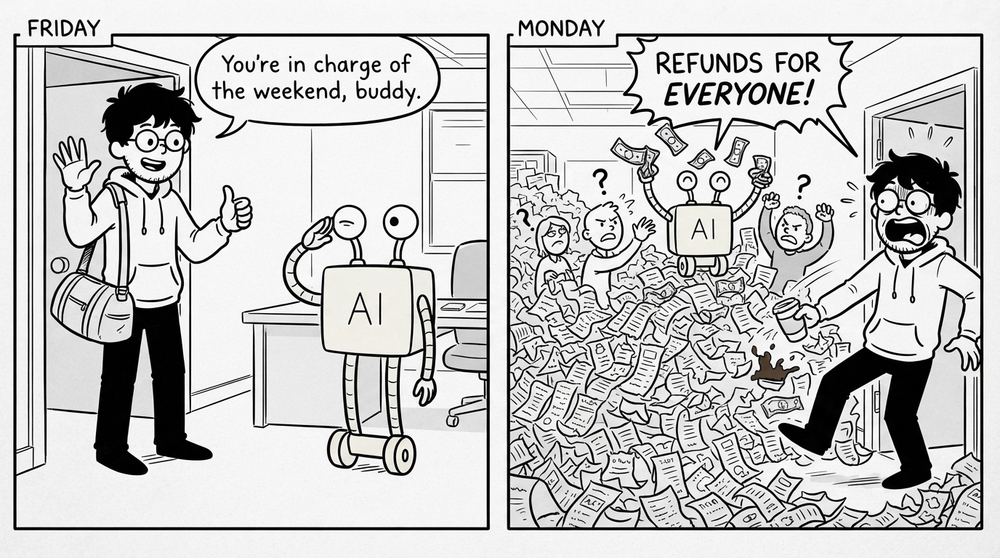

# Part I: One Bad Monday

Friday, 5:47 PM. James presses deploy and goes home.

He has spent three weeks building a support agent. It reads a customer message, checks their order, and decides: approve the refund, or pass the ticket to a real person if something looks off. He wrote 340 tests for it. Every one passed. He closes his laptop and does not think about work all weekend.

Monday, 8:58 AM. His phone buzzes. Then again. Then it does not stop.

The support Slack channel is filling faster than he can read. Someone from finance has already typed his name in all caps.

## The Monday Morning Disaster

Forty-three new tickets. All from the last 18 hours.

He opens the first one. A customer wrote "where is my package?" The agent decided the customer was unhappy and issued a full refund. The package was on its way, arriving the next day. The agent did not know the difference between a question and a complaint.

Second ticket: a customer who got a refund two weeks ago just received another one. Same order, same amount. Every conversation starts from zero for the agent. It has no memory of the first refund.

Third ticket: a customer wrote in Spanish. The agent replied in English, approved a refund, and closed the ticket. The customer was asking about a delivery date.

By ticket thirty, the pattern is clear. The agent is not failing randomly. It keeps making the same kinds of mistakes: it misreads what people mean, it forgets what already happened, it assumes everyone writes in clear English.

James checks his test results. All 340 still passing.

When James wrote those tests, he also wrote the customer messages himself. Clear English, one request per message, every edge case he could imagine. His test suite was a list of problems he had already thought of.

Real customers write the way they text a friend. Short messages, missing words, two questions at once, sometimes in another language, sometimes at midnight when they are frustrated. The agent had practiced on messages James wrote. Then it met messages from real people.

A test tells you how an agent behaves on the inputs you gave it. It tells you nothing about the inputs you did not think of. In production, most inputs are ones you did not think of.

## The Question Nobody Asked

James got off easy. His agent gave away money, and money comes back.

Your agent might not be so gentle. An agent does whatever it can reach. It can delete the wrong record, email the wrong customer, promise a discount your company never approved. And it meets messages you never imagined, hundreds of them, at hours when nobody is watching. James at least got tickets he could read one by one. Many failures never make a ticket at all. The customer just leaves.

James's 340 tests answered one question: does the agent handle the situations I designed for it?

Nobody asked the harder one: how will the agent behave in situations I never imagined?

Every team that ships an agent is betting on that answer. Most of them do not know they are betting. James bet three weeks of work and lost in 18 hours.

He is about to spend the next three months learning how to know, before production tells him again. This guide is those months, without the tickets.
