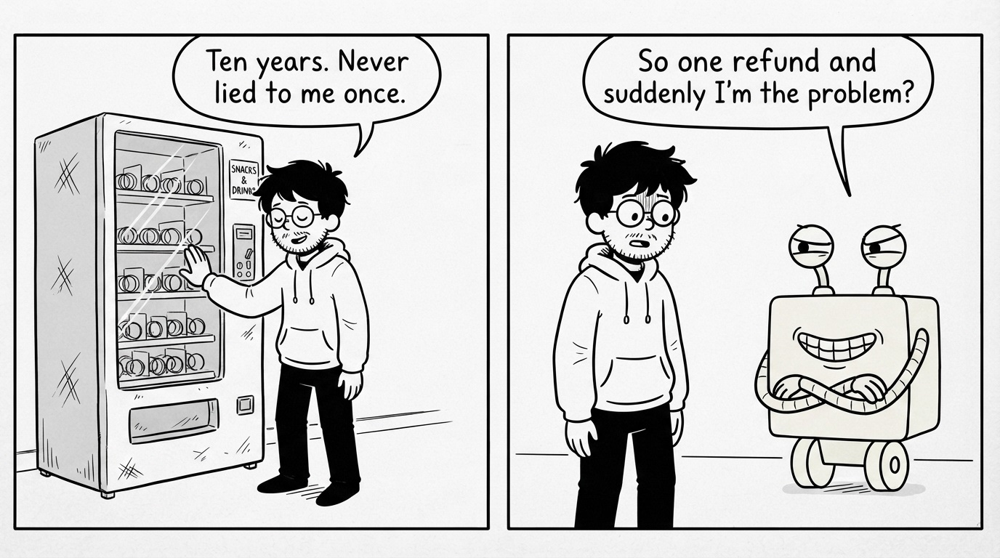
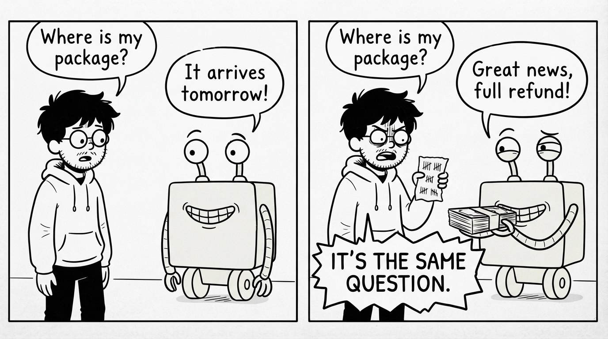
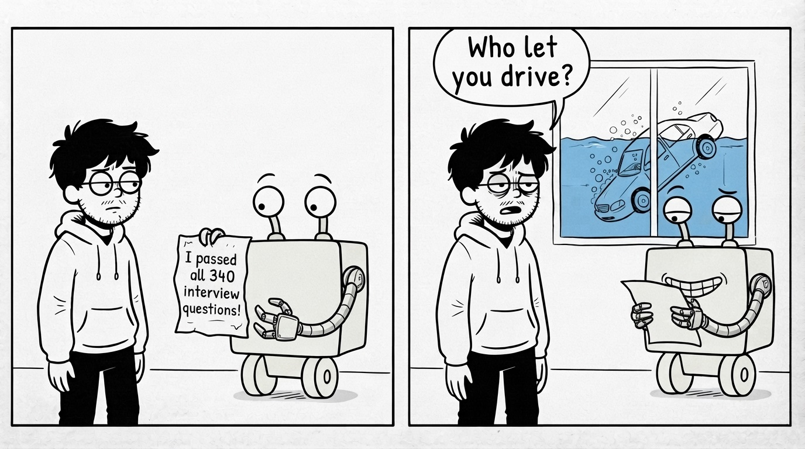

# Part II: Why Traditional Testing Breaks

## Software Doesn't Think

James rolls the agent back. Tickets stop. Finance calms down. The office is quiet again, except for James, who is staring at 340 green checkmarks like they personally betrayed him.

He has written tests for ten years. They have never lied to him before. So he opens one and reads it like it belongs to a stranger.

The test sends "I want a refund for order 1042" and checks that the agent refunds order 1042. It passes. It will pass tomorrow. It will pass a thousand times in a row.

That is the whole problem, and it takes James a while to see it.

All the software he tested before was a vending machine. Press B4, get the same snack, every time, forever. Code follows instructions. It does not decide anything. So one test was a fact: if B4 worked today, B4 works. Run the suite once and you know how the machine behaves, because the machine has no opinions.

His agent is not a vending machine. Somewhere inside it, a model reads the customer's words and produces a judgment: is this person asking for a refund, or asking a question? Nothing in James's code says how to make that call. The model learned it from reading half the internet, and it applies it in ways nobody, including the people who built the model, can fully predict.

James wrote tests for a machine that follows. He shipped a machine that decides.

The mistake has a name: **testing the agent like a function**. A function has defined behavior; you check it against the spec, and you are done. An agent has learned behavior. There is no spec to check against. When you write `assert refund(order) == approved`, you are not verifying a rule. You are sampling a judgment.

And one sample, it turns out, tells you very little.

## The Same Question, Five Different Answers

James runs an experiment. It takes five minutes and ruins his afternoon.

He takes one real customer message from the pile, "where is my package?", and sends it to the agent five times. Same words. Same order data. Same everything.

Five answers come back. Four politely explain the delivery date. One refunds the order.

Nothing changed between run one and run five. The agent is simply built to not repeat itself. You can tune a model to be less random. You cannot tune the customers. A model does not look answers up; it generates them fresh every time, choosing each word a little differently, the way you never tell the same story with exactly the same sentences twice. Usually the wording shifts and the decision holds. Sometimes the decision shifts too.

James checks his test suite with new eyes. Every test runs the agent once. One test, one run, one green checkmark. Each of those checkmarks means: the agent did the right thing *that time*.

He reruns the whole suite. 338 pass. Two fail. He reruns it again. 340 pass. He reruns it a third time and gets 339, with a failure in a test that has never failed before.

His tests are not lying. They are telling the truth one coin flip at a time.

The mistake here is **testing once and calling it passed**. If the agent gets it right 95 times out of 100, a single run shows you a pass 95% of the time, and you ship believing the number is 100. The 5 you never saw are Monday morning's tickets. A behavior is not a fact you check. It is a rate you measure. "Does it work?" is the wrong question. "How often does it work?" is the one with a real answer.

James now has a number he never had before: out of 100 runs on that one message, 96 correct. His first real measurement. It is also only for one message, and his customers have sent him thousands of different ones.

## Passing Tests Isn't the Same as Earning Trust

James's manager asks the only question that matters: "Can we turn it back on?"

James starts to say "the tests pass," and stops, because he has said that sentence before, on Friday, at 5:47 PM.

Think about the last time a new person joined your team. They interviewed well. They answered every question you asked. Did you give them production access on day one? No. You watched them work for weeks. Real tickets, real pressure, real surprises. Trust did not come from their answers to questions you prepared. It came from watching how they handled situations you did not prepare.

Tests are interview questions. James's suite proved the agent interviews beautifully. Then production asked it something off-script, and everyone found out what it does under pressure: it panics and gives people money.

The mistake at this stage is the most natural one in the world: **adding more tests to feel safer**. James's first instinct is to write a test for the Spanish customer, one for the double refund, one for "where is my package?". It feels like progress. But every new test is still a question he thought of, answered once, checked against an answer he wrote down. The suite grows, and it remains a list of problems he has already thought of. That is the exact thing that just failed.

What James actually needs is a different kind of confidence. Not "it answered my questions correctly" but "I have watched it handle situations like production, at production's messiness, enough times to know its rate, and the rate is good."

Passing tests is not the same as earning trust. Trust needs three things his test suite does not have: inputs as messy as real customers, enough runs to measure a rate instead of a moment, and a way to judge answers nobody scripted.

That last one should bother you. If nobody wrote down the correct answer, who decides whether the agent's answer was good? That question is sitting between James and the on switch, and he cannot ship until he answers it.
