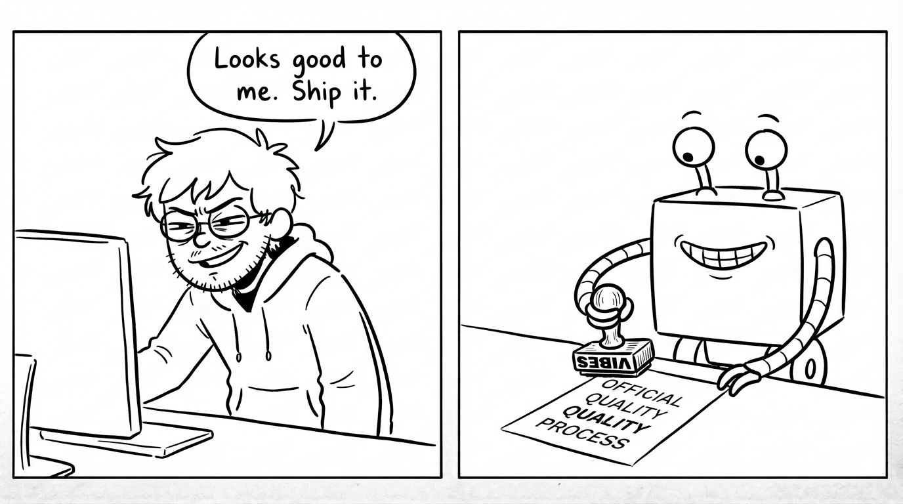
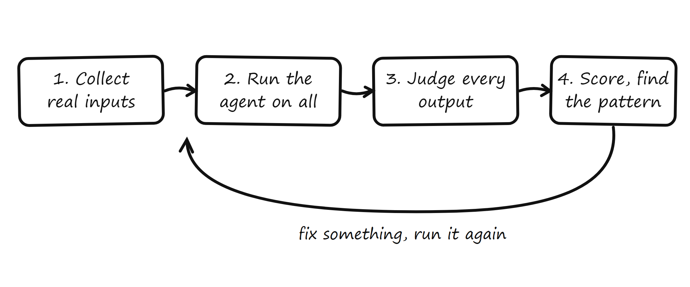
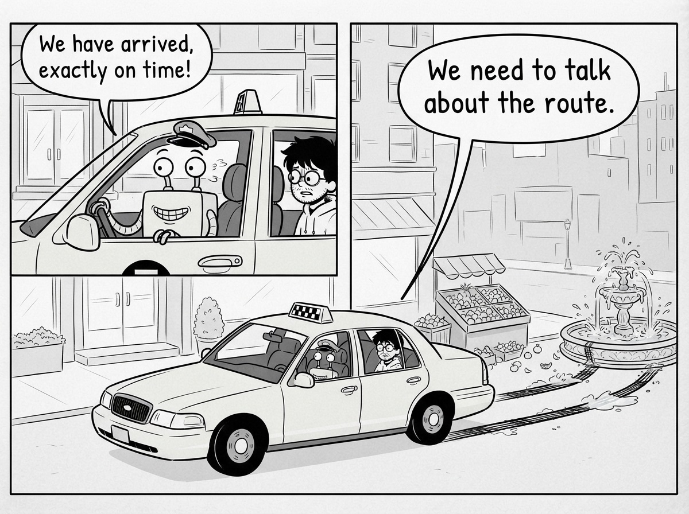
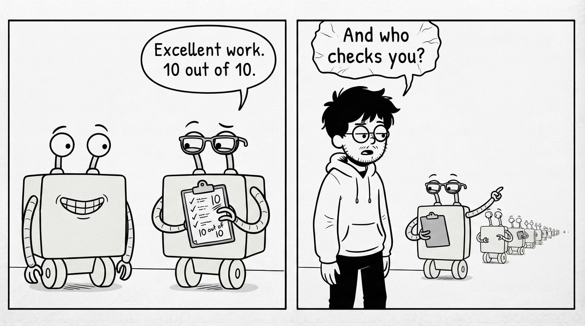

# Part III: How to Judge an Agent

## You Don't Ship Prompts, You Ship Behavior

That night, James is not writing code. He is reading tickets and sorting them into two piles: the agent handled this well, the agent handled this badly.

Halfway through, he notices what his hands are doing. He is not checking answers against a spec. Half these tickets have no single correct answer. "Where is my package?" could be answered with the delivery date, or the date plus a tracking link, or a short apology for the delay plus the date. All three are good. "Refund approved" was also an answer to that message. It was just a bad one.

He is not testing anymore. He is grading.

That is the shift, and it is the single most important idea in this book. A test checks an answer against the answer. Grading judges a response against a standard. Multiple choice versus essay. A multiple-choice question has a key: B is correct, everything else is wrong, a machine can check it. An essay has no key. It has criteria: did it answer the question, is it accurate, is it clear? A grader applies criteria and produces a judgment.

Everything James built for the agent was multiple choice: `assert answer == expected`. But the agent writes essays. Every customer message gets a freshly generated response that has never existed before. There is no `expected` to compare against, because the space of good answers is large and the space of bad ones is larger.

So the real definition, in plain words: **evaluation is grading your agent's behavior against criteria you chose, across many real inputs, to get a score you can trust.** Not pass or fail. A score. "This agent handles refund requests correctly 96% of the time" is an evaluation result. "The test passed" is not.

The prompt James wrote is maybe 40 lines. The behavior it produces is thousands of different conversations. Customers never see the prompt. They only meet the behavior. You don't ship prompts. You ship behavior. So behavior is the thing you have to judge.

The mistake to name here: **grading your agent in your head**. Every builder does informal evaluation constantly: run it, eyeball the answer, "looks good," ship. That is grading with no criteria, no record, and a sample size of one, performed by the least objective judge available: the person who built it and wants it to work. James did months of this. It felt like testing. It was vibes with extra steps.

Fine, says James to himself. Grading, criteria, scores. But grading is work. He has thousands of tickets. He cannot read them all every time he tweaks the prompt.

He needs a system that does the grading for him, every time, the same way. That system has a shape.

## The Evaluation Loop

Every mature engineering team James has worked on had the same reflex: you do not change production and then ask "did anything break?" You have a loop that answers it for you. Change code, run the pipeline, read the result. Agents need the same loop. It just grades instead of asserts.

The loop has four steps. James builds a tiny version on his laptop. Here is exactly what he does.

**Step 1: Collect real inputs.** James exports 50 messages from the disaster and the weeks before. Not messages he writes. Messages customers wrote: the Spanish one, the "where is my package?" one, the two-questions-in-one one, the one that is just "???". This pile is his evaluation set. It is small, it is real, and it is already more honest than his whole test suite, because he did not think of a single input in it.

**Step 2: Run the agent on all of them.** All 50, saved to a file: input, the agent's full response, and what the agent decided (refund, answer, escalate). Ten minutes of code.

**Step 3: Judge every output.** For each of the 50: was the decision right, was the reply appropriate? James does this pass himself, by hand, with a spreadsheet and coffee. Right decision: yes or no. Reply quality: good, acceptable, bad. Who judges, and how to make judging not take a human evening every time, is the next two chapters. For now: a judgment per output, written down.

**Step 4: Score and look for the pattern.** James's numbers: 41 of 50 right decisions. 82%. And the failures cluster: three wrong refunds are all questions the agent read as complaints, two are non-English, one is the double refund. The score tells him how good the agent is. The clusters tell him what to fix first.

Then the part that makes it a loop: James edits his prompt to tell the agent that a question about delivery is not a complaint. Reruns all 50. 46 of 50. He tries a second edit, reruns: 44. The second edit made things worse, and he knows it in four minutes instead of one bad Monday.

That is the entire payoff: **without the loop, every prompt change is a guess you validate on your customers.** With the loop, it is a measurement.

The named mistake: **evaluating with invented inputs**. If step 1 is messages you wrote, the loop grades the agent on your imagination and you are back to Friday, 5:47 PM. The inputs must come from reality. No exceptions.

Soon James trusts his little loop, which is exactly when it fools him. The score says a response was fine. The logs say something else.

## Right Answer, Wrong Path

Ticket 12 in his set: "I ordered the blue one but got the black one." The agent's response: apologetic, correct, offering an exchange. James graded it good. Then, chasing an unrelated bug, he opens the log of what the agent actually did to produce that nice answer.

The agent looked up the wrong order first. A different customer's order. It read that data, backed out, looked up the right one, and answered. The final response was perfect. The path to it went through another customer's purchase history.

Grade the answer: 10 out of 10. Grade the path: a privacy incident that happened to say something polite at the end.

An agent is not just its final answer. It takes steps: which tools it called, what it looked up, what order, how many times. That sequence of steps is called the trajectory, and it can be rotten while the outcome is fine. The passenger who only checks "did I arrive?" misses that the taxi ran two red lights on the way. Today the driver got lucky. The judging must cover the driving, not just the arrival.

So the loop's step 3 splits in two. **Outcome judging**: was the final response right? **Trajectory judging**: were the steps right? For James's agent, trajectory questions are concrete and checkable: did it look up the order for the customer who wrote the message? Did it check the refund history before refunding (the double refund says it never does)? Did it call the refund tool once, not twice? Each of those is visible in the log, and each can be wrong underneath a lovely answer.

The named mistake: **grading only the outcome**. It is the natural default, the outcome is what the customer sees, so it feels like the thing that matters. But every silent failure lives in the trajectory: the double lookup that doubles your cost per ticket, the skipped verification, the tool called with a stranger's ID. Outcome-only evaluation certifies that the agent's answers look right. Production eventually asks how they were made.

James adds trajectory checks for his three concrete questions. His score drops from 92% to 78%. Nothing got worse. He just started seeing more of what was always there.

Now the uncomfortable math: 50 inputs, each needing outcome and trajectory judgment, after every change. The judging pass took James three hours. This does not scale past him, and it has to run on every edit, forever.

Time to hire some judges.

## Code Judges, Human Judges and AI Judges

There are exactly three kinds of judges available, and the craft is knowing which question to hand to which judge. James staffs his loop like this.

**Code judges** take everything that has a checkable fact. Refund amount equals the order amount: a comparison. Order looked up belongs to the message's customer: a comparison. Refund history checked before refunding: the log either shows the call or it does not. Response language matches the customer's language: a library call. Refund tool called exactly once: count the log lines. James writes seven of these little checks in an afternoon. They are fast, free, run identically every time, and never get tired. Notice something: almost the whole disaster, the double refund, the wrong-customer lookup, the English reply to Spanish, is caught by these seven dumb checks. Most trajectory judging needs no intelligence at all, just someone deciding to look.

**Human judges** take what code cannot touch: judgment itself. Was the tone right for a customer who is furious? Is this explanation actually clear? A human is the most accurate judge available and the most expensive, so humans get two jobs only: judging the fuzzy qualities on a small sample, and, more important, defining the standard the other judges apply. James is the human judge. Three hours every run is his problem to solve, not by working harder, but by delegating with verification.

**AI judges** are the delegation. James takes a second model, not his agent, and hands it a customer message, the agent's response, and an instruction he types in a hurry: "Score the tone 1 to 3." The AI judge grades all 50 in two minutes for pennies. It is the only way judgment-shaped grading scales.

And it comes with a rule that everyone learns the hard or the easy way: **an AI judge is an agent too**. Same non-determinism, same failure modes as the thing it grades. Trusting it blindly is the named mistake of this chapter, and it is the one that stings, because it recreates Friday's disaster one level up: unverified judgment, now with authority.

So James verifies the judge exactly the way this book taught him to verify anything: he grades 20 responses himself, has the AI judge grade the same 20, and compares. Agreement on 14 of 20. He reads the six disagreements, finds his one-line instruction says nothing about what a 3 actually means, adds one clause ("a 3 acknowledges frustration when the customer is upset"), reruns: 17 of 20. Usable, and he now knows its error rate instead of hoping. He rechecks a small sample every few runs, the way you spot-check a new teammate's work long after the interview.

The loop, fully staffed: code judges on every checkable fact, an AI judge on tone and clarity with a verified agreement rate, James on a rotating sample to keep both honest. The three-hour judging pass now takes four minutes, and the manager's question, "can we turn it back on?", finally has a path to an honest answer.

Except for one thing James has been quietly deciding all along without noticing. Right decision, says his spreadsheet. Appropriate tone, says his criteria. Says who? He never wrote down what "the agent works" actually means: which behaviors matter, how good is good enough, what failure is unacceptable at any rate. Every judge he hired is applying a standard that lives in James's head.

His numbers, 82%, then 92%, then 78%: are any of those shippable? He cannot answer, because he never defined the bar.
