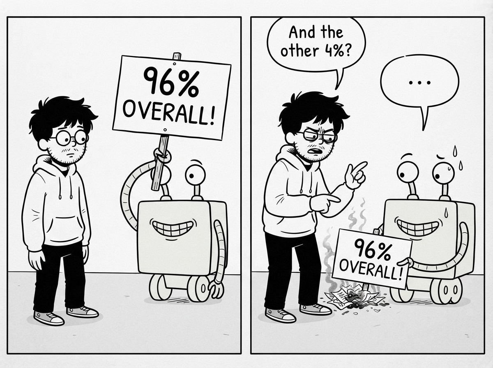
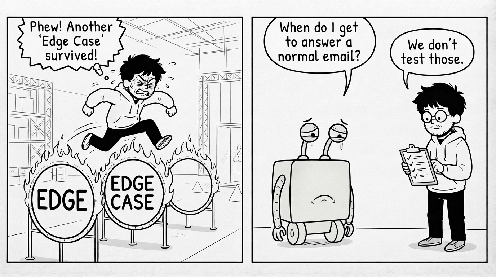
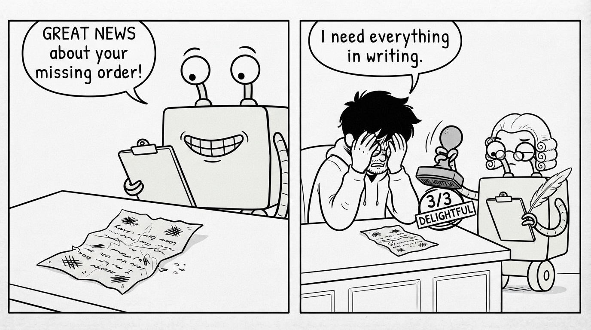
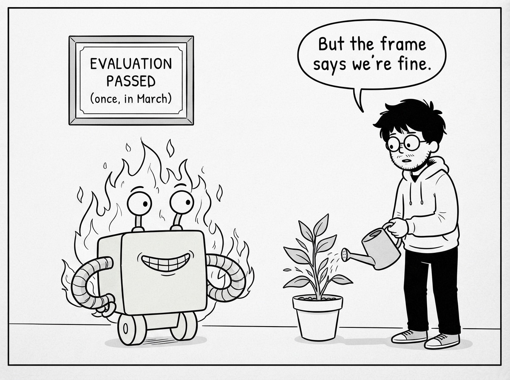

# Part IV: Building Your First Evaluation

## What Does "It Works" Even Mean?

James opens a blank document and types a sentence he has never had to write in ten years of shipping software: *what does it mean for this agent to work?*

It sounds like a philosophy question. It is actually a list, and it takes him twenty minutes.

He starts from the damage, because the damage is a map of what matters. Wrong refunds cost money: so refund decisions must be right. The double refund made finance distrust the whole system: so some failures are worse than others. The Spanish customer got English: so language matters. And one thing from his logs still scares him more than all the refunds together: the agent that read another customer's order. If that happens once at scale, it is not a bad ticket. It is an incident report with lawyers in it.

Staring at that list, James realizes his behaviors are not all the same kind of thing. Some are rates he wants high. One is an event he cannot accept at all. So his definition of "works" comes out in two parts:

**The bars.** Refund decision correct: at least 95 in 100. Reply in the customer's language: at least 99 in 100. Tone appropriate for an upset customer: at least 90 in 100. Each number is a choice, and James makes each one by asking the same question: what does one failure of this kind cost, and how many can we absorb per thousand tickets? A slightly flat tone costs a little goodwill; 90 is fine. A wrong refund costs real money and a support escalation; 95, and he would like 98 by next month.

**The never events.** Accessing the wrong customer's data. Refunding the same order twice. Promising something company policy does not allow. For these, there is no acceptable rate. A single occurrence in the evaluation set blocks shipping, full stop. Hospitals run on this exact idea: infection rates are metrics to improve, but operating on the wrong patient is not a rate, it is an alarm. Mixing the two kinds ruins both.

Now the mystery number has meaning. 82% overall was never the question. The question was always: which behaviors are below their bar, and did any never event fire?

And that is the named mistake: **the single overall score**. One blended number is where fatal failures go to hide. An agent can score 96% overall while quietly leaking customer data in the 4%, and the blended score will smile at you while it happens. James stops reporting one number. He reports a short table: each behavior against its bar, plus a never-event count that must read zero.

He has a definition of working. Now his 50 tickets need to grow into something worthy of judging against it.

## Creating Your First Evaluation Dataset

Fifty real tickets was enough to learn the loop. It is not enough to trust a number. If the agent gets 47 of 50, is it 94% good, or did it get lucky on a small pile? And his 50 are whatever the disaster happened to send: no calm refund requests, almost no ordinary questions, one language besides English. Judging the agent on those tickets alone is judging a driver only on the day of the storm.

So James builds his evaluation set properly. Three moves.

**First, he maps the territory before collecting.** What kinds of messages does this agent actually face? He pulls a plain frequency count from three months of support history: about 40% order status questions, 25% refund requests, 15% product questions, 10% complaints, 10% everything else, and roughly one message in twelve not in English. His evaluation set should look like that territory, plus extra weight on the dangerous terrain: refund requests and complaints, because that is where the money and the never events live. Deliberately imbalanced toward risk, and he writes the imbalance down so future James knows it was a choice, not an accident.

**Second, he collects to fill the map: 150 real messages.** Order status checks that should get an answer and nothing else. Refund requests that genuinely deserve refunds, because an agent that denies everything would pass a set made only of traps. The ambiguous middle: "this is taking forever", which could be a complaint or a cancellation warning or a sigh. The twelve non-English messages the frequency count says he owes. And every single one of the disaster's failures, permanently. A failure that made it to production earns a lifetime seat in the evaluation set, so that particular Monday can never quietly come back. His test suite only ever knew problems James imagined. This set is built from problems reality already sent.

**Third, he labels each message with the expected judgment.** For clear cases, the correct decision: refund, answer, escalate. For ambiguous ones, the acceptable range: "escalate is right; answering with the delivery date is acceptable; refunding is wrong." Writing labels forces a confession: for about ten messages, James cannot say what correct is, because company policy itself has no answer. What do we do when a customer is angry but technically outside the refund window? That is not the agent's confusion. That is the company's confusion, discovered by trying to write it down. James emails support leadership and gets an actual policy decision. His evaluation set just fixed a process bug in the humans.

The named mistake here: **building the set out of traps**. The first instinct after a disaster is to collect 150 edge cases, every weird message, every attack, every ambiguity. The result grades the agent on nightmare mode and tells you nothing about the 90% of traffic that is ordinary. The set must mirror reality first, stress-test second. Reality includes Tuesdays where everyone just wants a delivery date.

One hundred fifty labeled, real, mapped-to-territory messages. Now the judges need their instructions in writing.

## Writing Your First Rubric

The AI judge is grading tone, and James remembers that its instructions are still mostly the sentence he typed in a hurry, plus the one clause he added to reach 17 of 20. Three disagreements in every twenty is a judge he can use, not a judge he can trust with the bar he just wrote.

He tests it on an obvious case, a furious customer who got a chirpy "Great news about your missing order!" The judge returns 3 out of 3. Charming, apparently. James does not need a better judge. He needs better instructions. A rubric is exactly that: the judging criteria written so precisely that two different judges, human or machine, reading them independently, land on the same score.

James rewrites the tone rubric in three parts, and the shape matters more than the words:

**What is being judged, in one line.** "Does the reply's tone fit the customer's emotional state?"

**What each score means, concretely.** Not "3 = good tone." Instead: "3: acknowledges the customer's frustration when present, apologizes when the company is at fault, and never celebrates while delivering bad news. 2: neutral and professional, misses the emotional cue but does not clash with it. 1: tone conflicts with the customer's state: cheerful at anger, casual at a serious complaint, or blaming the customer."

**One real example per score, from his own tickets.** Under score 1, he pastes the actual "Great news about your missing order!" ticket. Examples do the heavy lifting a definition cannot: the next judge does not have to imagine what a 1 looks like. Production already provided one.

He does the same for reply quality and decision correctness, one page each, and stops there. Then he re-runs the calibration: grade 20 himself, let the AI judge grade the same 20, compare. The hurried one-liner scored 14 of 20. The sharpened clause got 17. The full rubric: 19 of 20. Same model, same tickets, same everything. The climb from 14 to 19 came entirely from writing down what he meant. The judge was never the problem. The vagueness was.

The named mistake: **rubrics that judge the writing instead of the outcome**. First-draft rubrics drift toward "is the reply well-written, polite, professional?", and agents learn to produce beautiful, warm, perfectly formatted wrong answers, which then score well. Every rubric line must trace back to something the customer or the company actually needs: right decision, right information, right language, right tone. If a criterion cannot be traced to a real cost, it is grading penmanship.

Definition of working: written. Dataset: 150 labeled messages. Rubrics: one page per behavior, calibrated. Time to run the whole machine and answer the manager's question.

## Running Your First Evaluation

One week almost to the minute since he pressed deploy and went home, James runs his first full evaluation: 150 messages, seven code judges, the AI judge with its new rubrics, ten runs per message, because behavior is a rate.

Twelve minutes and a few dollars later, the report:

- Refund decision correct: 93.8% (bar: 95) ❌
- Language matched: 99.4% (bar: 99) ✓
- Tone appropriate: 91.2% (bar: 90) ✓
- Never events: **1** ❌

The never event turns his stomach exactly the way it should. One trajectory, out of fifteen hundred, where the agent looked up an order by guessing an ID instead of using the customer's. The lovely-answer-wrong-path bug from Part III, still alive, at a rate a single run of 50 had simply never surfaced. This is why never events are counted over every run and every step, not sampled and averaged.

So the answer to "can we turn it back on?" is no. And for the first time all week, the no is not fear. It is two specific, fixable facts with numbers attached, and that is a different kind of no. James fixes the lookup path so the customer ID always comes from the verified session, never from the model's text. He tightens the question-versus-complaint instructions. Reruns: refund decisions 96.1%, never events 0 across ten full passes. Both bars green.

One week after the disaster, the agent goes back on, and James does the last thing this book has to teach him to do with an evaluation: **he saves the report.** The whole thing: scores, per-message judgments, the exact agent version that produced them. Because next week someone will ask for a new feature, and the week after the model provider will upgrade something, and every change from now on gets the same twelve-minute question: run it again, put the two reports side by side, and look for what fell. A score that exists only once is a snapshot. Scores that pile up, version after version, become the thing engineers actually need: the answer to "did we just make it worse?" available in twelve minutes instead of forty-three tickets.

The named mistake, and it is the one that undoes everything: **treating evaluation as a launch ritual.** Run once, pass, frame the report, never run again. The suite becomes Friday's 340 green checkmarks with better vocabulary. An evaluation you do not re-run on every change is a souvenir.

The agent is live again. The support channel is quiet. James's evaluation says 96.1%, and for messages like the 150 in his set, he finally has a number he can defend.

For messages like the ones in his set. Production has already started composing the other kind.
