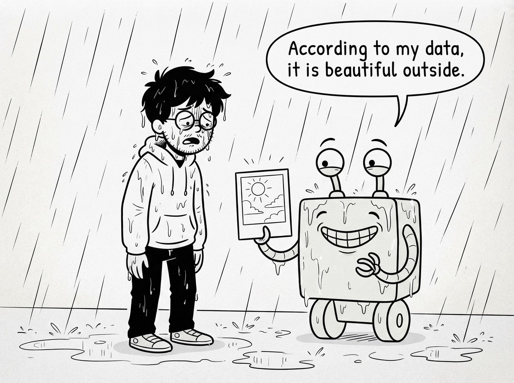
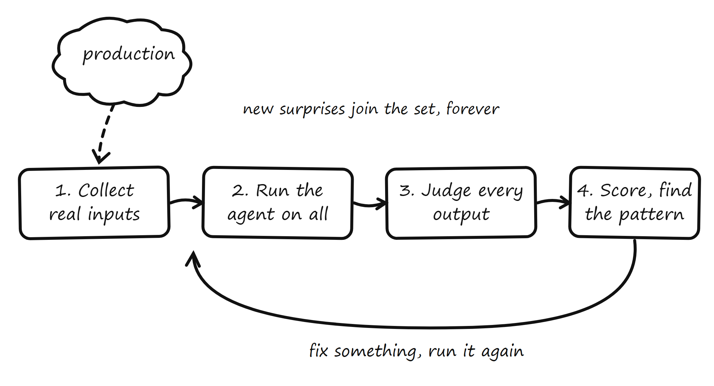
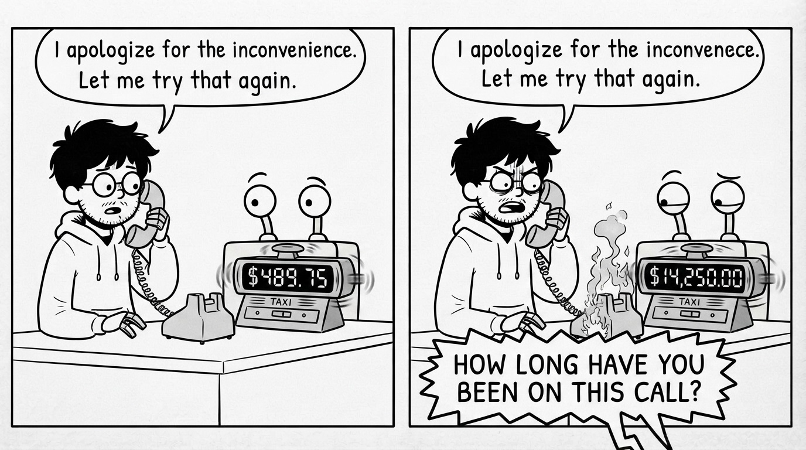
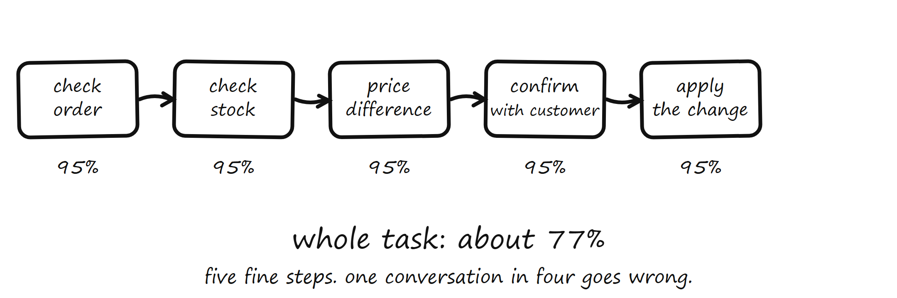
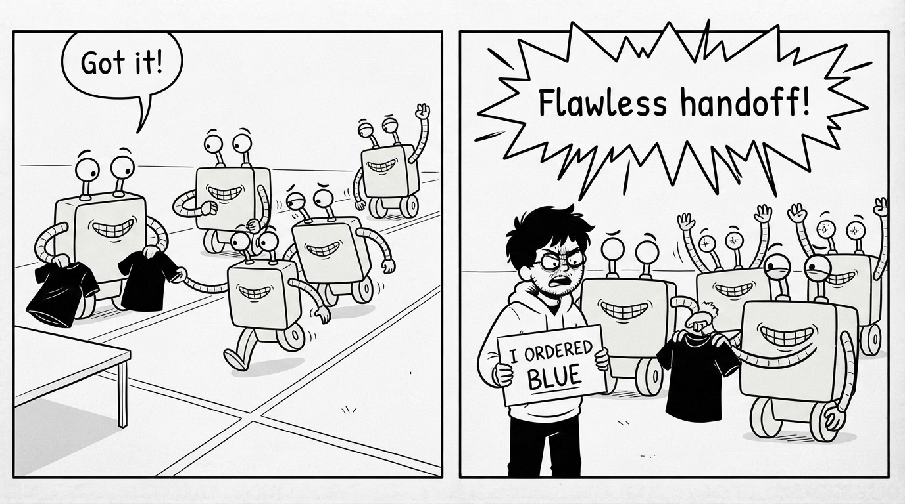
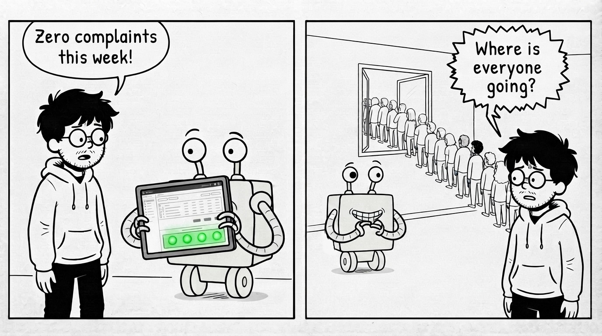

# Part V: Production

## Where Tests End

Three weeks later. The agent has been live and quiet, and James has almost stopped checking the dashboard hourly. His evaluation runs on every change. 96 and holding.

Then a customer writes: "hey so my sister ordered this for me as a gift but she used her account and I want to exchange the size, can I do that from my end?"

The agent handles it badly, of course. But that is not what stops James. What stops him is simpler: *nothing like this message exists in his 150.* Not the gift situation, not the two-accounts situation, not the exchange-not-refund situation. Three weeks ago he built a map of the territory from three months of history. The territory did not stop moving when he finished the map.

This is the fact about production that no amount of Part IV fixes: an evaluation set is a photograph. Production is weather. Customers invent new situations weekly. Marketing launches a gift-wrap feature and creates a whole new category of message. The model provider ships an upgrade and the agent's behavior shifts under James's feet without one line of his code changing. His 96.1% is true forever about the photograph, and true about the weather only for a while.

So the loop grows one final stage, the one that makes it self-sustaining: **production feeds the evaluation set.** Every week, James samples a slice of real conversations and runs his judges over them, the same rubrics, the same code checks. Not to block a release. To answer a different question: does production still look like my photograph? When the sampled score and the evaluation score drift apart, the map is stale. And every genuinely new situation the sample surfaces, like the gift-exchange message, gets labeled and added to the 150, which is now 164 and growing. The evaluation set stops being a thing James built in a week. It becomes a thing production builds for him, one surprise at a time.

The named mistake: **treating the evaluation set as finished**. A set that stops growing measures the past with increasing precision. Monday's failures earned lifetime seats; so does every new one production invents. If your set looks the same as it did two months ago, it is not a map anymore. It is a postcard.

James now knows how to keep watch. What he learns next is what to watch *for*, because agents in production fail in patterns, and the patterns repeat across every team that ships one.

## Common Failure Patterns

Three stories from James's next two months. Different weeks, same lesson: each pattern was invisible to outcome checks, sitting in plain sight in the trajectories.

**The bill.** A finance email: the agent's model costs tripled this week. No incident, no bad tickets, scores green. James pulls trajectories and finds the agent stuck in a polite loop on one customer whose order lookup kept timing out: try, apologize, try again, 60 times in one conversation. Two more like it. Three conversations, out of thousands, produced a third of the week's cost. Nothing in James's evaluation had ever asked "how much did this answer cost?", because cost is invisible in a transcript. The fix is two lines of policy: a step budget per conversation (after N tool calls, escalate to a human) and cost per conversation as a tracked number with an alarm, sitting right next to correctness. An agent that cannot run out of patience needs to be given a wallet with a limit.

**The chain.** A new feature: order changes, a five-step task. Check the order, check stock, calculate the price difference, confirm with the customer, apply the change. Each step, measured alone, is fine: roughly 95% each. James's instinct says the feature is 95% good. The arithmetic says otherwise, and the arithmetic is brutal: 95% five times in a row is 0.95 × 0.95 × 0.95 × 0.95 × 0.95, about 77%. Nearly one conversation in four goes wrong somewhere along the chain, built entirely out of steps that are each "fine." Worse, an early small error compounds: step one misreads which item to change, and steps two through five execute flawlessly on the wrong item, a perfect trajectory serving a mistake. This is why long tasks feel so much less reliable than the demos of each step. Reliability multiplies, and it only ever multiplies downward.

The fix is not "make every step perfect." It is checkpoints: after the risky early steps, the agent must confirm its understanding against something solid, the order data, or the customer ("Just to confirm: exchanging the blue medium for a blue large, is that right?"), so a wrong turn gets caught at step two, not delivered at step five.

**The quiet week.** Refund complaints drop. Tickets are calm. The dashboard has never looked better, and by now James has learned that a dashboard that suddenly looks *too* good is a smoke alarm with the battery removed. He samples trajectories and finds that since a prompt tweak two days earlier, the agent has been escalating almost everything to human support. Refusing politely, taking no risks, handing customers to a queue with a four-hour wait. The agent's error rate fell because it stopped doing its job. Customers were not complaining to the agent. They were leaving. This is the silent failure from the preface, all grown up: the worst production failures do not make tickets, because the failure is the absence of something, no refund issued, no answer given, no sale completed. Absence never files a complaint. The protection is to watch the agent's *behavior distribution*, not just its errors: what fraction of conversations end in refund, answer, escalation? Those numbers have a normal shape, and when one moves sharply in either direction after a change, something happened, even if nothing "failed." Especially if nothing failed.

One named mistake covers all three: **watching only the errors**. Cost hides in successful conversations. Compounding hides in individually green steps. Silent failure hides in an error rate that is *improving*. Production health is not the absence of red. It is every number sitting where it normally sits, and someone noticing when one does not.

## Thinking Like a Harness Engineer

Take inventory of what James actually owns now, three months after the worst Monday of his career.

An evaluation set that production grows weekly. Rubrics precise enough that any judge, human or machine, lands on the same score. Seven code judges and a calibrated AI judge. Bars chosen from real costs, never events wired to alarms. A step budget and a cost meter. Checkpoints inside long tasks. A watch on the behavior distribution. And a habit: every change, no matter how small, gets the twelve-minute question before it ships.

Now notice the strange thing: almost none of this is the agent. The prompt is still about 40 lines. Everything else, all of it, is the machinery *around* the agent. There is a name for machinery like that. When engineers need to trust something powerful and unpredictable, an engine, they never trust the engine's word for it. They build a test harness around it: instruments on every output, load on every input, alarms on every limit. The engine provides the power. The harness provides the knowing.

The agent is the engine. Everything James built is the harness. And the discipline of building it, choosing what to measure, writing the standards, staffing the judges, wiring the alarms, growing the map, has a name too: **harness engineering**. It is the actual job of shipping agents. Teams believe the job is prompting, and the market sells them the engine's brilliance. But the engine was never the hard part. The hard part is that you cannot trust what you cannot measure, and nothing about an agent is measurable until you build the thing that measures it.

Which reframes the question this book opened with. "How do you know your AI agent actually works?" was never a question about the agent. It is a question about you: *did you build the harness?* Without one, "it works" means "it worked while I was watching, on the inputs I tried." With one, it means something an engineer can sign: "here is the behavior, here is the rate, here is the bar it clears, here is the alarm that fires if that stops being true."

James still ships on Fridays sometimes. He pressed deploy last Friday at 5:52 PM, five minutes later than the Friday that started this book, and went home without checking his phone once all weekend. Not because he is confident. Because the harness is watching, and confidence and knowing are different things. He got the difference tattooed on his workflow instead of his arm.

One honest thing before the last page. Everything in this book stands on one component: those 150 messages, now 164. The set is the ground truth the whole harness rests on, and this book built it the quick way, one afternoon, one frequency count, one pass of labels. It was enough to start. It is not enough to lean on for a year: how large the set really needs to be, how to label at scale without a week of evenings, how to know when your set is lying to you. That is its own craft, and it is the next book in this series: *Building Your First Evaluation Dataset.*

The robot, for the record, has kept its job. It remains cheerful, occasionally wrong, and permanently supervised.
