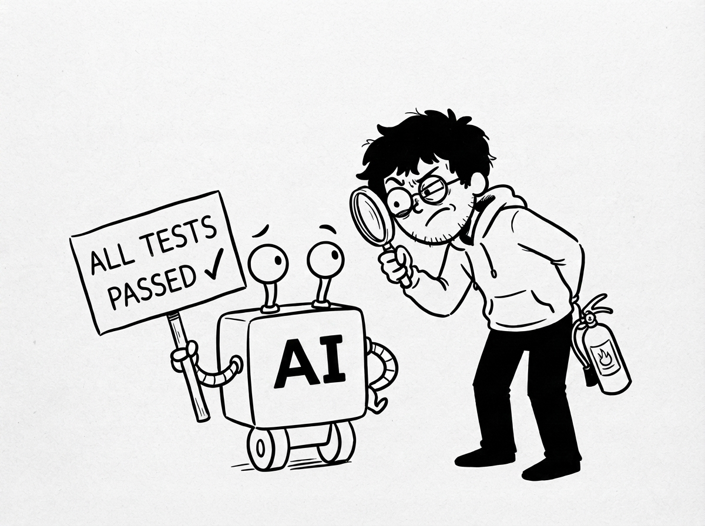

# How Do You Know Your AI Agent Actually Works?

Harness Engineering Series #1 · Version 1.0 · Sara Mohseni

  

**[Download the PDF](how-do-you-know-your-ai-agent-actually-works.pdf)** (recommended: it has the comics in place and the
layout the text was written for).

---

### [Part I: One Bad Monday](01-one-bad-monday.md)
The Monday Morning Disaster · The Question Nobody Asked

### [Part II: Why Traditional Testing Breaks](02-why-traditional-testing-breaks.md)
Software Doesn't Think · The Same Question, Five Different Answers · Passing Tests Isn't the Same as Earning Trust

### [Part III: How to Judge an Agent](03-how-to-judge-an-agent.md)
You Don't Ship Prompts, You Ship Behavior · The Evaluation Loop · Right Answer, Wrong Path · Code Judges, Human Judges and AI Judges

### [Part IV: Building Your First Evaluation](04-building-your-first-evaluation.md)
What Does "It Works" Even Mean? · Creating Your First Evaluation Dataset · Writing Your First Rubric · Running Your First Evaluation

### [Part V: Production](05-production.md)
Where Tests End · Common Failure Patterns · Thinking Like a Harness Engineer

---

Something wrong or unclear? [Open an issue](https://github.com/nugalaxy/harness-engineering-guides/issues).
Licensed [CC BY-NC-ND 4.0](../LICENSE).
